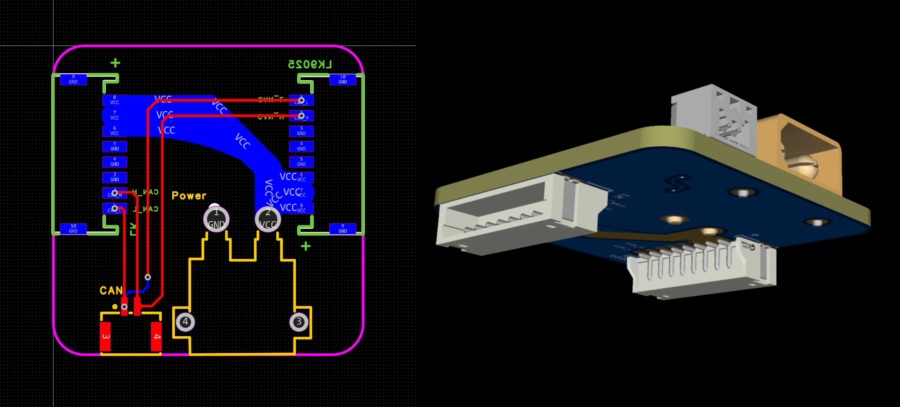

# The Realization of a Wheel‐Legged Biped Robot

# 双轮足机器人的设计与实现

## Abstract 摘要

> 摘要应简明、扼要地概括出本论文的主要内容，主要说明本论文的研究目的、内容、方法、成果和结论。要突出本论文的创造性成果或新见解，不要与引言相混淆。

本文主要研究目的是从头开始建造一台双轮足机器人。通过机械、电气、嵌入式、控制算法四个方面建造了一台双轮足机器人。

## Keywords 关键词

> 关键词（3-5个）是供检索用的主题词条，应采用能覆盖论文主要内容的通用技术词条(参照相应的技术术语标准)。按词条的外延层次排列（外延大的排在前面）。摘要与关键词应在同一页。

控制原理，机器人，电路设计，嵌入式

## Introduction 引言

> 引言是论文正文的开端，目的在于对论文和研究有个总体的简要介绍，要求言简意赅。内容主要包括研究的目的、背景；理论依据、实验基础和研究方法或实验设计；预期结果和意义等。

在本科期间学生会学习非常多的控制算法，但却鲜有将控制算法真正部署的经验。虽然在一些实验课中学生有机会将已经编写好的控制算法部署到硬件上的经验——如系统控制与建模的实验课中学生们可以将PID、LQR等算法部署到倒立摆上——但学生对于从控制理论到控制算法再到硬件中一行行代码并最终驱动硬件运动的过程仍感到困惑。

购买一套现成的硬件也是一种很好的选择，但这难以让学生理解整个系统的运作机制，特别是代码的功能如何变成硬件的运动。解答这些困惑有利于让学生们对控制理论拥有更具象的理解。因此我认为从零开始搭建一个实验平台是有必要的。本项目以一个双轮足机器人为例，详细记录了整个硬件搭建过程以及控制理论转变为代码部署的过程，包括机械设计和组装，电气连接，嵌入式代码编写，控制算法设计，并撰写了这篇论文，希望可以成为对控制理论部署的最佳实践。

## Body 主体

> 论文主体是毕业论文的主要部分，必须言之成理，论据可靠，严格遵循本学科国际通行的学术规范。在写作上要注意结构合理、层次分明、重点突出，章节标题、公式图表符号必须规范统一。

双轮足机器人的建造中设计的技术栈主要包括机械、电气、嵌入式、控制等部分，在这个章节中我们将分别详细介绍各个部分的实现过程以及注意事项，其中我们将重点介绍电气和嵌入式部分。

### 机械设计、制造和组装

在机械结构方面，这辆轮足机器人主要由机身框架、关节电机、腿部结构、轮电机、充气轮组成，电池、控制板、分电板、急停开关等电气结构放置在中部的机身框架上。整体机械结构是在ARTINX机器人实验室2024赛季平衡步兵的基础上加以优化而来，如下图所示。


### 电气

电气部分主要包括红外急停开关和电气连接两个方面

#### 红外急停开关TODO

为了保证调试过程中测试人员的安全，我们通常需要使用急停开关对整机进行紧急断电。但是由于轮腿机器人自由度高的特点，使用传统的急停开关很容易在测试人员关闭开关时由于机器人的运动对测试人员造成二次伤害，因此，我们在本项目中使用了红外急停开关。

红外急停开关的硬件设计主要由红外接收器、继电器、升降压模块、主控芯片组成，搭配遥控器使用。急停开关工作时，红外接收模块接收特定红外信号，并由主控进行解码，若红外信息的地址码和设备码与程序吻合，则控制继电器断开实现机器人整体的断电。

#### 电气连接TODO

我们建造的机器人需要进行电气连接的部分包含四个关节电机、两个轮电机、开发板和急停开关，将如此多的设备连接起来并且电线优雅整洁需要一番周折，因此我们专门设计了中心分电板和线材转接板。

##### 中心分电板

对于六个电机来说，需要供电并传输信号，因此我们考虑将电源线和信号线一起布设，为防止电源线对信号线的干扰，我们使用差分信号传输信息的can总线。基于此我们设计了中心分电板，如下图所示。


我们将电源线接口和信号线接口布置在同一块分电板上，这样使电源线和信号线可以同时走线，减少了重复走线的工作量。

##### 线材转接板

对于轮电机瓴控MF9025，其接口采用`zh1.5 8pin`，需要转换为`XT30+gh1.25 2pin`才能插接到分电板。若采用线材焊接的方式，焊接后线材的稳定性难以保证，且由于不是非标准线材，制作难度大，维护性较差。为此我们专门设计了线材转接板，这样我们只需要使用标准`zh1.5 8pin`线材就可以连接轮电机，降低了线材制作难度，提高了整体的可维护性。线材转接板如下图所示。



### 嵌入式代码

在介绍完机器人的硬件设计后，下面我们介绍机器人的软件设计，也就是运行在开发板中的嵌入式代码。

#### 整体框架

本项目使用的嵌入式代码采用顶层底层解耦的方式，这样可以提高代码在不同芯片之间的可移植性，从而降低后续升级芯片时移植代码的难度。

本项目的库函数使用Hardware Abstraction Layer（HAL）库，它通过封装底层寄存器操作，提供统一的API接口，使得代码在不同STM32系列（如F1/F4/H7）间移植时只需修改少量硬件相关配置，无需重写外设逻辑。

> https://www.st.com.cn/zh/embedded-software/stm32cubef4.html#documentation

本项目的嵌入式操作系统使用FreeRTOS，它的抢占式调度算法，支持优先级继承机制，确保高优先级任务及时抢占低优先级任务，中断延迟低至微秒级，满足本项目对实时性的需求。同时它支持多任务并发机制，开发者在编写程序时无需手动实现多任务调度，避免了重复造轮子，提升了开发效率。

本项目的工具链为CubeMX+Keil。其中CubeMX用于生成底层代码，CubeMX的图形化操作省去了大量底层配置代码的编写，且CubeMX生成的代码规范易于维护。keil用于进一步编写代码和代码编译烧录以及调试，且我们使用Keil compiler version 6进行编译，编译速度是compiler version 5的四倍以上，大幅节约了在编译项目时的等待时间。

#### 底层配置和BSP板级支持包（中间层）

本项目用到的硬件主要包括

1. RoboMaster开发板C型
2. 遥控器富斯I6X及接收器A8S
3. 惯性测量单元（IMU）BMI088
4. 磁力计IST8310
5. 关节电机海泰HT8115-J9（曾用名HT-04-9）
6. 轮电机瓴控MF9025
7. 其他硬件
   1. 板载LED
   2. 板载蜂鸣器
   3. 板载IMU加热电阻丝
   4. 板载ADC

为了使用这些硬件，我们需要通过底层代码使能芯片对应的外设，并编写中间层板级支持包（BSP），即每种硬件对应的驱动。

##### RoboMaster开发板C型

为了使用这款开发板，我们需要对它进行基本的配置。

这款开发板使用STM32F407IGHx作为主控芯片，主频168MHz，支持两路can通信、六路UART通信、三路SPI通信、三路I2C通信，可以驱动我们所提到的所有硬件。

我们使用CubeMX对芯片进行配置。

首先进行时钟配置。在CubeMX的`New Project`中选择`STM32F407IGHx`，配置`System Core->RCC->HSE=Crystal/Ceramic Resonator`. 之后在顶部的`Clock Configuration`中将`Input frequecncy`设置为`12(MHz)`，这是开发板上晶振的频率。`PLL Source Mux`选择`HSE`，配置`/M`为`/6`，配置`*N`为`X168`,配置`/P`为`/2`，`System Clock Mux`选择`PLLCLK`，配置`APB1 Prescaler`为`/4`，配置`APB2 Prescaler`为`/2`。如下图所示


之后进行系统配置，点击顶部的`Pinout & Configuartion`，配置`System Core->SYS`，其中`Debug`配置为`Serial Wire`，`Timebase Source`配置为`TIM6`.再配置`Middleware and Software Packs->FREERTOS->Interface=CMSIS_V1`.

最后点击顶部的`Project Manager`，给工程起名，设置工程的位置，配置`Application Structure`为`Basic`，配置`Toolchain/IDE`为`MDK-ARM`。再点击左侧的`Code Generator`，勾选`Copy only the necessary library files` 以及 `Generate  peripheral initialization as a pair of ‘.c/.h’ files per peripheral`.点击右上角的`GENERATE CODE`即可生成代码。

> [RoboMaster开发板 C 型](https://www.robomaster.com/zh-CN/products/components/general/development-board-type-c)
>
> [RoboMaster/Development-Board-C-Examples](https://github.com/RoboMaster/Development-Board-C-Examples)

##### 遥控器富斯I6X及接收器A8S

###### 底层代码

接收器A8S使用常见的SBUS协议与主控芯片进行通信。

SBUS协议通信接口使用USART，采用TTL电平，但高位取反（负逻辑，低电平为“1”，高电平为“0”）。因此在硬件设计上需要设计反相电路。本项目使用的RoboMaster开发板C型的DBUS接口自带反相电路，因此我们无需另行设计。

> [STM32 Futaba SBUS协议解析_接收机与bus-CSDN博客](https://blog.csdn.net/Brendon_Tan/article/details/89854751)

我们使用RoboMaster开发板C型的DBUS接口（使用USART3）对数据进行接收，因此我们需要在CubeMX中使能USART3和对应的Direct Memory Access（DMA）。

在左侧的`Connectivity`中设置`USART3`的`Mode=Asynchronous, Baud Rate=100000 Bits/s, Word Length=8 Bits(including Parity), Parity=Even, Stop Bits=2, Data Direction=Receive Only`，如下图所示 


之后在`USART3->DMA Settings`中点击`Add`添加DMA，设置`DMA Request=USART3_RX, Priority=Very High`。如下图所示。


至此我们就完成了对串口和DMA的配置。

> [RoboMaster/Development-Board-C-Examples](https://github.com/RoboMaster/Development-Board-C-Examples)

###### BSP

在这一部分我们需要了解SBUS协议并对串口接收到的遥控器数据进行进一步的处理。

The protocol of SBUS is 25 Byte long, using USART, and one Byte = 1 startbit + 8 databit + 1 paritybit + 2 stopbit, baudrate = 100'000 bit/s. A data frame is combined by `[startbyte] [data1] [data2] .... [data22] [flags] [endbyte]`.

SBUS的数据帧包含25个字节，并且每个字节的传输都包括1个起始位，8个数据位，1个校验位和2个停止位。每一个数据帧由1个开始字节，22个数据字节，1个标志位字节和1个结束字节组成。

> [Futaba S-BUS controlled by mbed | Mbed](https://os.mbed.com/users/Digixx/notebook/futaba-s-bus-controlled-by-mbed/)

| 字节位 |  Byte1   |            Byte2-23            |           Byte24            |  Byte25  |
| :----: | :------: | :----------------------------: | :-------------------------: | :------: |
|  类型  | 开始字节 | 通道数据字节（含16个脉宽通道） | 标志位字节（含2个数字通道） | 结束字节 |
|  数据  |   0x0F   | 通道数据范围11Bits = [0,2047]  |   2个数字通道位+2个状态位   |   0x00   |

对于Byte2-23，传输数据共22Bytes=16*11Bits(CH1-16)，由于通道数据低位在前，每个通道包含11Bits数据，因此转化后的通道内容如下表所示。

原始内容

| byte | 2        | 3          | 4          | 5            | 6        | 7          | etc  |
| ---- | -------- | ---------- | ---------- | ------------ | -------- | ---------- | ---- |
| 内容 | 12345678 | `12345678` | *12345678* | **12345678** | 12345678 | `12345678` | etc  |

发送内容

| byte | 2        | 3          | 4          | 5            | 6        | 7          | etc  |
| ---- | -------- | ---------- | ---------- | ------------ | -------- | ---------- | ---- |
| 内容 | 87654321 | `87654321` | *87654321* | **87654321** | 87654321 | `87654321` | etc  |

通道接收内容

| 通道 | CH01          | CH02            | CH03              | CH04       | etc  |
| ---- | ------------- | --------------- | ----------------- | ---------- | ---- |
| 内容 | 87654321`876` | `54321`*876543* | *21***87654321**8 | 7654321`8` | etc  |

转化后的通道内容

| 通道 | CH01          | CH02          | CH03            | CH04          | etc  |
| ---- | ------------- | ------------- | --------------- | ------------- | ---- |
| 内容 | `678`12345678 | 345678`12345` | 8**12345678**12 | `5678`1234567 | etc  |

我们通过位运算的方式进行解码，若想获得`CHO1`的数据，我们可以通过对`Byte1`和`Byte2`进行移位或并与`0b0000 0111 1111 1111(0x07ff)`获得，代码示例如下，完整代码见GitHub。

```C
uint16_t CH01 = ((Byte1 >> 0) | (Byte2 << 8)) & 0x07ff;
uint16_t CH02 = ((Byte2 >> 3) | (Byte3 << 5)) & 0x07ff; ...
```

富斯I6X遥控器最多支持十个通道，前六个通道对应四个摇杆以及两个旋钮，后四个通道对应四个拨杆。我们需要在顶层配置中将通道信息映射为遥控器的摇杆和拨杆信息。

> [STM32 Futaba SBUS协议解析_接收机与bus-CSDN博客](https://blog.csdn.net/Brendon_Tan/article/details/89854751)

##### 磁力计IST8310(TODO)

我们使用磁力计和IMU的数据进行融合来估测机器人的当前姿态。这部分我们会进行磁力计的配置。

###### 底层代码

我们使用STM32F407IGHx的I2C与IST8310进行通信。

首先我们需要在CubeMX的`Connectivity`中找到`I2C3`设置`Mode=I2C，I2C Speed Mode=Fast Mode`，之后在`I2C3->GPIO Settings`配置PA8,PC9均为上拉，其余保持默认，如下图所示。


又因为在开发板上IST8310的复位管脚RSTN与主控的PG6相连，数据准备标志管脚DRDY与主控的PG3相连，因此我们需要在右侧的芯片示意图中配置PG3和PG6，之后在左侧`System Core->GPIO`中配置。

对于PG3，我们需要外部中断，下降沿出发，因此配置`GPIO mode=Exrernal Interrupt Mode with Falling egde trigger detection, GPIO Pull-up/Pull-down=Pull-up, User Label=DRDY_IST8310`. 对于PG6，我们需要上拉输出，因此配置`GPIO mode=Output Push Pull, GPIO output level=High, GPIO Pull-up/Pull-down=Pull-up, Maximum output speed=Medium, User Label=RSTN_IST8310`.如下图所示


###### BSP(TODO)

##### IMU BMI088

在这一部分我们会进行IMU的配置。

###### 底层代码

我们使用STM32F407IGHx的SPI与BMI088进行通信。

我们需要让STM32在全双工SPI下作为主机运行，因此需要在CubeMX的`Connectivity`中找到`SPI1`设置`Mode=Full-Duplex Master, Hardware NSS Signal=Disable`，之后设置`Prescaler=256, Clock Polarity=High, Clock Phase=2 Edge`，其他保持默认。如下图所示


因为SPI1的默认GPIO设置与开发板不同，因此我们需要在`GPIO Settings`中将`SPI1_MOSI`由`PB5`修改为`PA7`,同时修改三个引脚为上拉，如下图所示。


最后我们再开启`SPI1`对应的DMA。在`DMA Settings`中点击`Add`，如下图所示修改。


此外我们需要分别配置加速度计和陀螺仪的片选引脚和数据就绪引脚，如下图所示


###### BSP(TODO)


##### 关节电机与轮电机

关节电机和轮电机是机器人主要的执行机构，在这一部分我们会对它们进行配置。

###### 底层代码

我们使用STM32F407IGHx的CAN总线与关节电机和轮电机进行通信。

首先我们需要在CubeMX的`Connectivity`中找到`CAN1`设置`Mode=Activated，Time Quanta in Bit Segment 1=11 Times, Time Quanta in Bit Segment 2=3 Times, Prescaler=3, Automatic Bus-Off Management=Enable`，其余保持默认，如下图所示。


为了接收电机在CAN总线上反馈的消息，我们还需要在NVIC中打开`CAN RX0 interrupts`，如下图所示


对于CAN2也做上述相同配置。

额外地，因为CAN1的默认GPIO设置与开发板不同，因此我们需要在`GPIO Settings`中将`CAN1_RX`由`PB8`修改为`PD0`，将`CAN1_TX`由`PB9`修改为`PD1`，其余保持默认，CAN2的GPIO配置也保持默认，如下图所示。


###### BSP(TODO)


##### 板载LED

我们可以通过板载LED反映系统运行的状态，在这一部分我们会配置它。

###### 底层代码

板载LED为全彩LED，我们可以通过分别配置RGB通道的亮度来实现多种颜色的照明。在本项目中，我们使用PWM分别对LED的三个通道进行控制。

首先在CubeMX的`Timers`中找到`TIM5`，勾选`Internal Clock`，并配置`Channel1=PWM Generation CH1`，在下方`Counter Settings`中设置`Counter Period=65535`，再设置`PWM Generation Channel 1`中的`Pulse=10000`，之后在`GPIO Settings`中设置`PH10`的`GPIO Pull-up/Pull-down=Pull-up, Maximum output speed=High, User Label=LED_B`。对于`Channel2`和`Channel3`也做相似配置，如下图所示。


###### BSP(TODO)

##### 板载蜂鸣器

我们使用板载的无源蜂鸣器来发出提示音，在这一部分我们会配置它。

###### 底层代码


与LED类似，蜂鸣器也是通过PWM来控制的。我们可以通过配置PWM的频率来控制无源蜂鸣器发出不同频率的声音。

首先我们在CubeMX的`Timers`中找到`TIM4`，勾选`Internal Clock`，并配置`Channel3=PWM Generation CH3`，在下方`Counter Settings`中设置`Prescaler=679, Counter Period=279`，之后在`GPIO Settings`中将`TIM4_CH3`的引脚设置为`PD14`，并设置`GPIO Pull-up/Pull-down=Pull-up, Maximum output speed=Very High, User Label=BUZZER`.如下图所示


###### BSP(TODO)

##### 板载IMU加热电阻丝

由于IMU存在温漂，我们需要使其在恒定温度下工作，因此我们需要对IMU加热电阻丝进行加热。与LED和蜂鸣器类似，板载IMU加热电阻丝也是通过PWM来控制的。

###### 底层代码

首先我们在CubeMX的`Timers`中找到`TIM10`，勾选`Activated`，并配置`Channel1=PWM Generation CH1`，在下方`Counter Settings`中设置`Prescaler=167, Counter Period=4999`，再设置`PWM Generation Channel 1`中的`Pulse=500`，之后在`GPIO Settings`中将`TIM10_CH1`的引脚设置为`PF6`，并设置`GPIO Pull-up/Pull-down=Pull-up, Maximum output speed=High`.

###### BSP(TODO)


##### 中断配置（TODO）

##### FreeRTOS配置

至此我们就完成了所有底层和中间层配置

#### 顶层配置

完成了上述底层和中间层配置后，我们就可以开始编写顶层代码了。顶层配置主要包括对底层和中间层的调用，以及对FreeRTOS的配置。

在FreeRTOS中，我们需要创建一个优先级最高的主任务和优先级较低的系统状态显示任务。

在主任务中我们实现了机器人的姿态估计和电机电流控制，从而实现整车正常运动。若主任务正常执行，系统没有阻塞，则FreeRTOS会执行系统状态显示任务。在系统状态显示任务中，我们实现了LED的呼吸等效，这样若主任务正常运行，则LED会以一定频率变换颜色，若主任务阻塞，则LED不会变换颜色。

我们在主任务中首先对每个设备进行了初始化，并使用中断的方式获取每个传感器的反馈信息，使用轮询的方式将反馈信息传入控制算法，经过计算后向执行机构发送控制指令。

对于IMU的加热和电机的速度位置控制，我们采用了PID算法，对于轮足机器人的姿态控制，我们采用了LQR算法。


## Conclusion 结论

> 结论是毕业论文的总结，结论应概括说明本论文的价值、优点和特色，并着重阐述自己的创造性成果及其在本研究领域中的意义，还可进一步提出需要讨论的问题和建议。语言应简明，篇幅不宜过长。

通过机械、电气、嵌入式、控制算法四方面的设计，我们成功地搭建了一个双轮足机器人实验平台，并在此基础上实现了机器人的运动控制。并且在此过程中我们完成了机器人整体的机械结构搭建，设计了红外急停开关和用于电气连接的中心分电板和线材转接板，使用HAL库使能了芯片的各种外设并编写了各个传感器和执行器的驱动，使用了FreeRTOS作为嵌入式操作系统，最后使用了PID和LQR算法实现了机器人的运动控制。

未来我们将继续对该实验平台进行改进，增加更多的传感器和执行器，并使用更复杂的控制算法来实现更复杂的运动控制。同时我们也希望能将该实验平台应用于更多的实际场景中，如山林巡检、工业探测等领域。

## Reference 参考文献

> 参考文献是毕业设计(论文)不可缺少的组成部分，它反映论文作者的科学态度和毕业设计(论文)的取材来源、广博程度和可靠程度，同时能方便地把作者的研究成果与他人的成果区别开来。一份完整的参考文献也是向读者提供的一份有价值的信息资料。一般做毕业设计(论文)的参考文献不宜过多，但应列入主要的中外文献。

[ARTINX_EEE / ARTINX_CORE / BalancedInfantry · GitLab](https://mirrors.sustech.edu.cn/git/artinx_eee/artinx_core/balancedinfantry)

[RoboMaster/Development-Board-C-Examples](https://github.com/RoboMaster/Development-Board-C-Examples)

## Appendix 附录

> 对于一些不宜放入正文中的重要支撑材料，可编入毕业设计(论文)的附录中。如，公式的推演、编写的算法语言程序、设计图纸等重要补充说明材料。如果毕业设计(论文)中引用的实例、数据资料，实验结果等符号较多时，为了节约篇幅，便于读者查阅，可以编写一个符号说明，注明符号代表的意义。附录的篇幅不宜过多，附录一般不要超过正文。

## Acknowledgements 致谢

> 在文章的结尾处，应以简短的文字对自己的论文工作曾提供过直接帮助和支持的人表示谢意。
